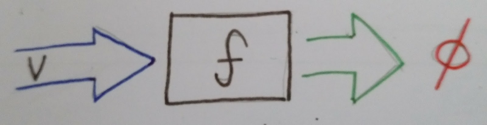
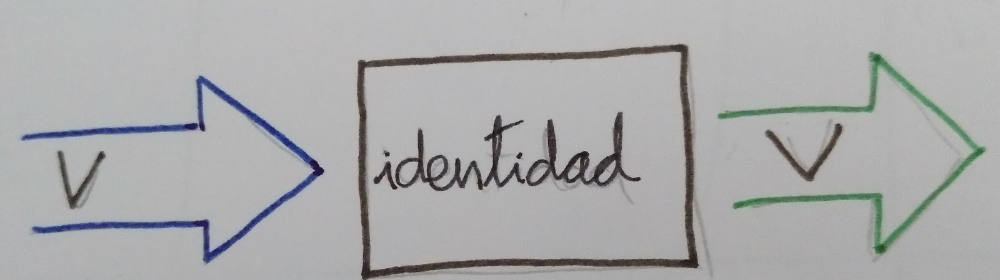

The Basics
==========

Field operations
----------------

**TODO: explain how we build the operation from field to a complete process**

An ETL process is composed by a group of performed operations on a row and rows are composed by groups of columns.
So the minimal possible operation is performed on a field.

Suppose a function is useless on a field V:

As the process is composed by operations on fields, if we execute this function to a row with one field V, there won't be output.

Thus we need an usable function, as example a basic function that keeps value of a field. This function returns the input
and its name is identity:

How process errors in data
~~~~~~~~~~~~~~~~~~~~~~~~~~
One of the most important situations we have to process is errors on data.
A typical issue is when we expect some field but row doesn't have it (unstructured data source).

If any transformation fails we must report precisely without stop the process. All reasons for failure will aggregate by row,
so the datascientist will have all the issues regarding a row together, and the process will continue with the next row.
Because of this, field error will not stop the row process, and this one will not stop the dataset process. On production
environment unexpected data is a common issue, so this data must be logged along their reasons for further
research and process improvement.

To fix this problem, Data Refinery transformation functions returns the transformed value and the possible error.
This situation takes us to three scenes:
- Function returns a value and no error.
- Function returns an error and provokes the value doesn't matter.
- Function execution is OK, but there is not value.

In the first case we can use the transformed value.
In the second one, we don't care about the value because there is an insuperable error.
Finally it depends on the current operation, the process rejects the field or fails because there is not value.

List of functions
~~~~~~~~~~~~~~~~~

On data transformation processes, it's common to transform types or values if a
condition is triggered, decompose data,..  Data Refinery has defined this kind
of functions. Furthermore, if it's necessary we can create our own functions.

More complex situations can be solved chaining together two or more simple
functions. This atomic design allows changes on application behaviour with very
little user effort.

The majority of ETL's functions require some context parameters in order to
produce another, more specialized function. This specialized function can then
be used to transform the field. This style of operation improves simple
composition given that all functions will have the same input and output
instead of a variable number of parameters.

type_enforcer
.............

Expected function in order to cast the value to a type that can rise a cast exception.

Sometimes, data source doesn't contain type or this type is wrong (numbers as string, etc).
This function use as context a type changer function. If this function raises an error, type enforcer will return None
and the error message raised.

For example, if you want to change the data type to integer:

.. code-block:: python

    from datarefinery.FieldOperations import type_enforcer

    int_enforcer = type_enforcer(lambda x: int(x))
    (res, err) = int_enforcer("6")
    print(res) # 6

min_max_normalization
.....................

Typical operation on machine learning. It consists of interpolate a value between 0 (as minimum) and 1 (as maximum).
So, this function need a context with the maximum and minimum to run. For example:

.. code-block:: python

    from datarefinery.FieldOperations import min_max_normalization

    normalizator = min_max_normalization(1, 10)
    (res, err) = normalizator(5)
    print(res) # 0.5

std_score_normalization
.......................

Returns the distance of a particular datum ...

This operation represents how far it's the value from mean, using deviation as scale.

The function requires two input parameters, the column average and the standard
deviation. Usage example:

.. code-block:: python

    from datarefinery.FieldOperations import std_score_normalization

    normalizator = std_score_normalization(79, 8)
    (res, err) = normalizator(85)
    print(res) # 0.75

buckets_grouping
................

Transform a lineal numeric value into a categorical one. For instance it can be
used to group users by age.

A minimum of one input value is mandatory. This will produce two groups, the
first one from negative infinity to the given value, and the second one from
the given value to infinity.

For example, in order to categorize users into three groups (children, adults
and elderly) the values 18 and 70 can be passed to the function. This will
produce the following groups:

1. From negative infinity to 18.
2. From 18 to 70.
3. From 70 to infinity.

.. code-block:: python

    from datarefinery.FieldOperations import buckets_grouping

    group = buckets_grouping(18, 70)
    (res, err) = group(10)
    print(res) # 1
    (res, err) = group(20)
    print(res) # 2
    (res, err) = group(73)
    print(res) # 3

linear_category
...............

Translates the textual value of a field into a numeric value given a list of
possible values.

The input value is a list of categories. Keep in mind that this list must
always be in the same order to consistently translate the values.

The translated value will be the category index of the list.

As an example, the age can be categorized again, but this time the input a text
value instead of a numeric one.

.. code-block:: python

    from datarefinery.FieldOperations import linear_category

    categorizer = linear_category(["niño", "adulto", "jubilado"])
    (res, err) = categorizer("adulto")
    print(res) # 2

column_category
...............

Translates the textual value of a field into a set of columns given a list of
possible values. A column will be produced by each one of the members of the
input list. This columns will have a value of `0` by default except for the
corresponding category that will have a value of `1`. This is known as *one hot
vector*.

Example:

.. code-block:: python

    from datarefinery.FieldOperations import column_category

    categorizer = column_category(["niño", "adulto", "jubilado"])
    (res, err) = categorizer("niño")
    print(res) # {"niño": "1", "adulto": "0", "jubilado": "0"}

This operation adds new columns, so is usually used along with an event operation of type [append](##Change it).

add_column_prefix
.................

Adds a prefix to the column name. This is useful in a scenario when other
function generates a new column with the same name of another already existing.

.. code-block:: python

    from datarefinery.FieldOperations import add_column_prefix

    prefix = add_column_prefix("good")
    (res, err) = prefix({"one": "me"})
    print(res) # {"good_one": "me"}

explode
.......

Flattens a nested data structure even when is made up by a list of objects.

In the case of just one inner object, only the original name prefix will be added.

When multiple objects are present the same prefix will be added and in
addition, a numerical suffix (starting on 1) fo the second position.

In this example we exploded the field `name`:

.. code-block:: python

    from datarefinery.FieldOperations import explode

    explode_name = explode("name")
    (res, err) = explode_name({"name": {"first": "Bob", "last": "Dylan"}})
    print(res) # {"name_first": "Bob", "name_last": "Dylan"}

replace_if
..........

Replaces a value when some condition fulfilled.

Two functions are expected, the former should return a boolean value and the
latter should produce a new value in case of the former function returns
`True`. Both function will receive the field value.

As an example, if we want to replace by zero all negative values:

.. code-block:: python

    from datarefinery.FieldOperations import replace_if

    change = replace_if(lambda x: x<0, lambda x: 0)
    (res, err) = change(-3)
    print(res) # 0

date_parser - time_parser
.........................

Tries to parse a date with the given list of date formats. If none of the
formats successfully parses the date then the function returns an error.

The expected formats are Python standard time formats.

.. code-block:: python

    from datarefinery.FieldOperations import date_parser

    parser = date_parser(["%Y-%m-%d"])
    (res, err) = parser("2017-03-22")
    print(res) # <datetime class>

There is a similar function to format hours, minutes and seconds.

explode_date - explode_time
...........................

Transforms a datetime object to a series of columns with numeric values.

.. code-block:: python

    import datetime
    from datarefinery.FieldOperations import explode_date

    (res, err) = explode_date(datetime(2017,3,22))
    print(res) # {"year": 2017, "month": 3, "day": 22, "hour":0, "minute": 0, "second": 0}

If multiple date exists on the event, please consider using the function [add_prefix](###Prefijo de columna). If no all fields are needed the function [remove column](###Quitando columnas) can be used.

This function is typically used along with `date_parser`.

remove_columns
..............

Removes one or more columns from a set.

This function is usually used along with other functions which generate
multiple columns.

In case of not require a column, is better just not to operate it. This
non-operated column will be removed automatically.

.. code-block:: python

    import datetime
    from datarefinery.tuple.TupleDSL import compose
    from datarefinery.FieldOperations import explode_date, remove_columns

    only_year_month = compose(explode_date, remove_columns("day", "hour", "minute", "sencond"))
    (res, err) = only_year_month(datetime(2017,3,22))
    print(res) # {"year": 2017, "month": 3}

match_dict
..........

Translates values from a table.

.. code-block:: python

    from datarefinery.FieldOperations import match_dict

    d = {"Spain": "ES", "United States of America": "US"}
    iso_decoder = match_dict(d)
    (res, err) = iso_decoder("Spain")
    print(res) # "ES"

Composing field operations
~~~~~~~~~~~~~~~~~~~~~~~~~~

This powerful concept from functional programing allow us to build complex
applications using simple blocks (functions).

Composition is similar to programming in the sense that a small set of
operations can be combined to solve a very large set of problems.

All functions on the library can be combined together using the function
`combine`.

This concept is better shown by example.

Normalize Numeric Data
......................

Convert a numeric string to a numeric format and then normalize using min max approximation.

.. code-block:: python

    from datarefinery.tuple.TupleDSL import compose
    from datarefinery.FieldOperations import type_enforcer, min_max_normalization

    str_2_min_max = compose(
        type_enforcer(lambda x: int(x)),
        min_max_normalization(0, 100)
    )
    (res, err) = str_2_min_max("50")
    print(res) # 0.5

Date data
.........

Explode a date is a typical operation too. It keeps year, month and day as data. Furthermore, it adds a prefix to avoid
problems with other fields.

.. code-block:: python

    from datarefinery.tuple.TupleDSL import compose
    from datarefinery.FieldOperations import date_parser, explode_date, remove_columns, add_column_prefix

    complete_date = compose(
        date_parser(["%Y-%m-%d"]),
        explode_date,
        remove_columns("hour", "minute", "second"),
        add_column_prefix("x")
    )
    (res, err) = complete_date("2017-03-22")
    print(res) # {"x_year": 2017, "x_month": 3, "x_day": 22}

Day to one hot vector
.....................

This example returns one hot vector using a date string and week days.

.. code-block:: python

    from datarefinery.tuple.TupleDSL import compose
    from datarefinery.TupleOperations import wrap
    from datarefinery.FieldOperations import date_parser, match_dict, column_category

    week_days={
        0: "Mo", 1: "Tu", 2: "We", 3: "Th", 4: "Fr", 5: "Sa", 6: "Su"
    }

    def day_of_week(dat):
      return dat.weekday()

    day_hot = compose(
        date_parser(["%Y-%m-%d"]),
        wrap(day_of_week),
        match_dict(week_days),
        column_category(week_days.values())
    )

    (res, err) = day_hot("2017-10-19")
    print(res) # {"Mo": 0, "Tu": 0, "We": 0, "Th": 1, "Fr": 0, "Sa": 0, "Su": 0}

Event operations
----------------

Field functions has no affect on the row, so we need Event functions; maybe we need to change the value of a field; or
maybe create a new field.
Field functions has the same interface. They receives the input, and return result and error.
Think in this functions as a tools for dictionaries.

List of functions
~~~~~~~~~~~~~~~~~

keep - Keep files
.................

Keep is the simplest operation, no need of any field function. In essence take the value of a field from the input and
put it on the output without change neither the value nor the name of field.

.. code-block:: python

    from datarefinery.TupleOperations import keep

    operation = keep(["greet"])
    (res, err) = operation({"greet": "hello", "who": "world"}, {})
    print(res) # {"greet": "hello"}

If you need keep several similar fields you can use keep_regexp.

substitution - Value Substitution
.................................

The next operation change the value of a field with the supplied field function. This function will not change the
name of the field. By example, given a to_float function, you can do this:

.. code-block:: python

    from datarefinery.TupleOperations import wrap, substitution

    operation = substitution(["greet"], wrap(lambda x: len(x)))
    (res, err) = operation({"greet": "hello", "who": "world"}, {})
    print(res) # {"greet": 5}

append - Append new fields
..........................

Usually we need add new field or change the name of the field. We can use append to do this, but it expects a
field function that return a python dictionary, where every key will be a new field. By example, given a len_cap function that
will return the len of a string and the first letter in uppercase:

.. code-block:: python

    from datarefinery.TupleOperations import wrap, append

    operation = append(["greet"], wrap(lambda x: {x: "you", "y": "None"}))
    (res, err) = operation({"greet": "hello", "who": "world"}, {})
    print(res) # {'hello': 'you', 'y': 'None'}

Notice that the field "greet" it's not in the output. Append only add the result of the function, and the function has no
"greet" in their output.

fusion - several fields one output
..................................

We already define functions to change the values and add more than one field to the output. But also we can create one
field from several inputs.

This function it's complex, and we have several scenarios. Also need the name of the new field.
By example we can sum several numeric fields into total field.

.. code-block:: python

    from datarefinery.TupleOperations import wrap, fusion

    operation = fusion(["a", "b", "c"], "sum_abc", wrap(lambda x: sum(x)))
    (res, err) = operation({"a": 1, "b": 2, "c": 3}, {})
    print(res) # {'sum_abc': 6}

But we can perform some decision with the input fields. Suppose that you need to change the value of money amount
field by currency code field. But functions receive only one parameter input, so fusion will put all the values in
a list as the input, in the same order that you request in fields field.
Knowing that, we can decompose the list into the fields that we need.

By example, given a function to_eur that convert any currency into EUR:

.. code-block:: python

    def to_eur_wrapped(x):
      [currency, value] = x
      return to_eur(currency, value)

We can use this way with fusion:

.. code-block:: python

    from datarefinery.TupleOperations import wrap, fusion

    val_eur_op = fusion(["currency", "value"], "val_eur", wrap(to_eur_wrapped))
    (inp, res, err) = val_eur_op({"currency": "USD", "value": 1})
    print(res) # {"val_eur": 0.8459}

fusion_append - Multiple values in, multiple values out
.......................................................

In fact it's the same that a fusion, but expect that the field function returns a python dict, in the same way than
append function.

We can perform the same example that fusion but we can generate new fields with the currency as name of field and
the money value as value:

.. code-block:: python

    from datarefinery.TupleOperations import wrap, fusion_append

    def to_eur_cols(x):
      [currency, value] = x
      return {"EUR": to_eur(currency, value), currency: value}

    val_eur_op = fusion_append(["currency", "value"], "val_eur", wrap(to_eur_cols))
    (res, err) = val_eur_op({"currency": "USD", "value": 1})
    print(res) # {"EUR": 0.8459, "USD": 1}

filter_tuple - Discard irrelevant
.................................

When we don't need all data, the best approach it's discard as soon as possible the rows that we don't need.

With no_none function and filter field operation the genearted function will return None as result if the event
it's discarded:

.. code-block:: python

    from datarefinery.TupleOperations import wrap, filter_tuple

    no_none = filter_tuple(["value"], wrap(lambda x: x is not None))

    (res, err) = no_none({"value": None})
    print(res) # None

It's up to you not to fail when result it's None, if no error means that event is discarded.

alternative - Plan B
....................

Some times we have several ways to transform the event. If the first approach fail, alternative will try the
next, until success or the last fail.

Suppose that you want to multiply by two, but if this operation fail, you want to append value 0.

.. code-block:: python

    from datarefinery.TupleOperations import wrap, alternative, substitution, append

    need_value = alternative(
        substitution(["value"], wrap(lambda x: x*2)),
        append(["name"], wrap(lambda x: {"value": 0}))
    )
    (res, err) = need_value({"name": "John"})
    print(res) # {"value": 0}

Combine event operations
~~~~~~~~~~~~~~~~~~~~~~~~
Normally, a transformation is a group of different type of functions, not only one type. For example, you want to keep
some fields and change the value of a field using a function.

So that's why we need an interface for doing this kind of transformations. Data Refinery has two functions to perform
this kind of work: parallel and sequential.

With sequential you can perform transformations that affect the same data several times, like, generate two new fields
and then sum together.

With parallel you can change several fields using the same input and with no interactions between them.

For example, if we want to keep a field and replace another field value with a x2 function (multiply by two):

.. code-block:: python

    from datarefinery.TupleOperations import wrap, keep, substitution
    from datarefinery.CombineOperations import secuential

    x2 = wrap(lambda x: x*2)

    tr = secuential(keep(["name"]), substitution(["value"], x2))
    operation = tr.apply()
    (inp, res, err) = operation({"name": "John", "value": 10})
    print(res) # {"name": "John", "value": 20}

A world of possibilities
........................

We can save our set of transformations every time we want becuase it's just a plain function.

Training data is often as production data, but it contains an extra field called "label". This field indicates what
machine learning model must learn.

In next example, data transformation is a specified module of your application. You can get it with *etl* function.
Then we will add the label logic:

.. code-block:: python

    from datarefinery.TupleOperations import keep
    from datarefinery.CombineOperations import parallel

    op = etl()
    if training == True:
        operation = parallel(op, keep("label"))
    else:
        operation = op

By this way, the output will contain the label without knowing other transformations over the data during training phase.

Sequentiality
.............

When you use parallel to create a group of operations, these are executed in one step. In other words, all operations use
the same input and write in the same output. So, if we want to modify the value of a field which have been modified yet,
even using parallel, all operations take place at the same time and we only see the last transformation.

For example:

.. code-block:: python

    from datarefinery.TupleOperations import wrap, substitution
    from datarefinery.CombineOperations import parallel

    x2 = wrap(lambda x: x*2)

    operation = parallel(substitution("value", x2), substitution("value", x2))
    (res, err) = operation({"value": 2})
    print(res) # {"value": 4}

In this example, you expect output value will be 8, but it's not true. When operations run in parallel, the
execution is something like this:

=========  ====================  ===================
  input      value (1st time)      value(2nd time)
=========  ====================  ===================
    2               4                     4
=========  ====================  ===================

The input is the same for both operations and the output of the first operation was overwritten by the second one.

If you want to do different operations on the same value field, then you have to use *compose*. This function lets
operations run sequentially, as the next example:

.. code-block:: python

    from datarefinery.TupleOperations import wrap, substitution, compose

    x2 = wrap(lambda x: x*2)

    operation = substitution("value", compose(x2,x2))
    (res, err) = operation({"value": 2})
    print(res) # {"value": 8}

Review exercises
----------------

If you want or need to do basic exercises for review all your knowledge, you can execute the next notebook on your
Jupyter instance: `thebasics.ipynb <https://github.com/BBVA/data-refinery/blob/master/docs/notebooks/thebasics.ipynb>`_.
